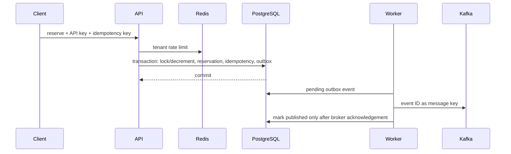
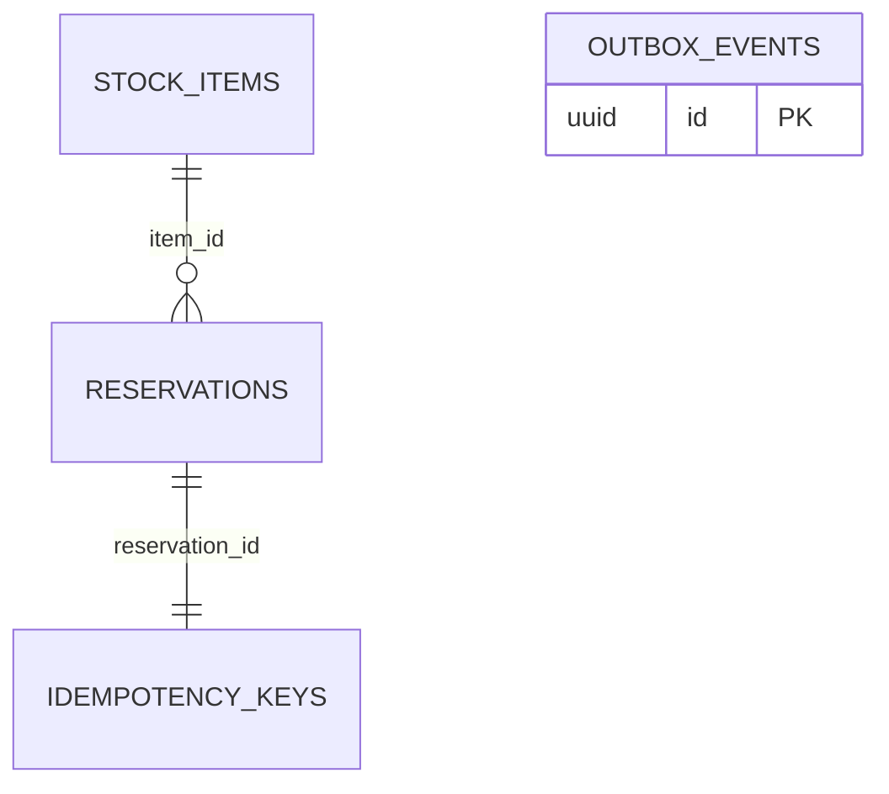

# Architecture

```mermaid
sequenceDiagram
Client->>API: reserve + API key + idempotency key
API->>Redis: tenant rate limit
API->>PostgreSQL: transaction: lock/decrement, reservation, idempotency, outbox
PostgreSQL-->>API: commit
Worker->>PostgreSQL: pending outbox event
Worker->>Kafka: event ID as message key
Worker->>PostgreSQL: mark published only after broker acknowledgement
```

```mermaid
erDiagram
STOCK_ITEMS ||--o{ RESERVATIONS : item_id
RESERVATIONS ||--|| IDEMPOTENCY_KEYS : reservation_id
OUTBOX_EVENTS { uuid id PK }
```
